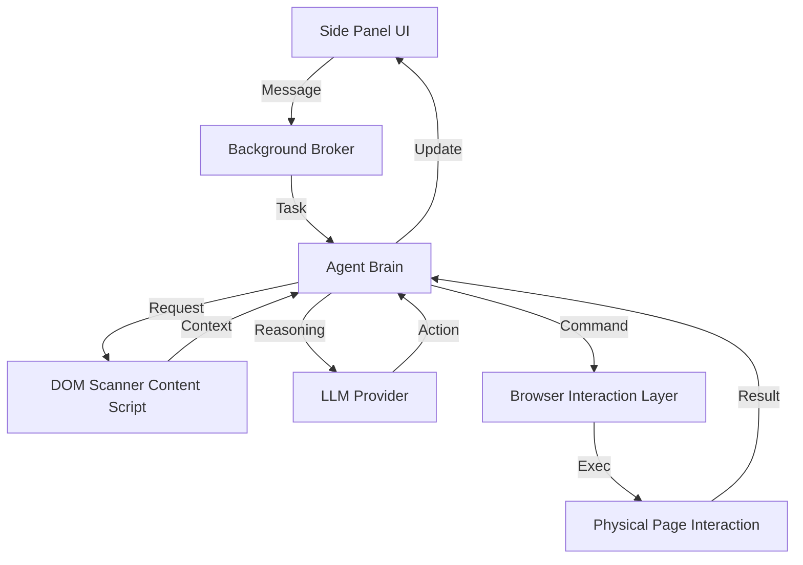

# WebSurfer Modular Architecture Detail

WebSurfer is organized as a modular monorepo. This document provides a granular breakdown of the modules and sub-modules that power the agentic browser experience.

---

## 1. Core Background Engine (`/chrome-extension/`)

The background service worker acts as the orchestrator for all agentic behavior, browser control, and UI state management.

### **A. Agent Brain (`src/background/agent/`)**
The logic for reasoning and task planning.
- **`prompts/`**: Manages the system context for the LLM. Includes the `Navigator` and `Planner` templates.
- **`strategies/`**: Orchestrates the multi-step reasoning cycles (e.g., *Planning* -> *Action* -> *Verification*).
- **`messages/`**: Service layer for passing states and HITL (Human-in-the-Loop) pauses to the Side Panel UI.
- **`executor/`**: The core runtime that manages the loop of fetching context, invoking the LLM, and executing actions.

### **B. Browser Interaction (`src/background/browser/`)**
An abstraction layer over the standard Chrome Extension APIs.
- **`dom/`**: Specifically handles analysis of the webpage.
  - **`service.ts`**: Builds the accessibility tree and identifies interactive elements.
  - **`clickable/`**: Optimized detection for buttons, links, and input fields.
- **`page/`**: Low-level execution of browser events.
  - **`interaction.ts`**: Performs actual clicks, typing, and scrolling.
  - **`lifecycle.ts`**: Monitors tab loading states and navigation events.

### **C. Background Services (`src/background/services/`)**
Ancillary logic required for a production-grade agent.
- **`guardrails/`**: Safety layer that sanitizes LLM output and enforces security patterns.
- **`analytics.ts`**: Tracks agent performance and task completion metrics.
- **`speechToText.ts`**: Logic for voice-driven interaction processing.

---

## 2. User Interface Views (`/pages/`)

Decoupled React applications providing dedicated views for interaction and configuration.

### **A. Side Panel (`pages/side-panel/`)**
The primary workspace for user-agent collaboration.
- **`components/`**: Modular UI elements including the `ChatHistoryList`, `ChatInput`, and `WelcomeScreen`.
- **`hooks/`**: Custom hooks (`useSidePanelController.ts`) that bridge the UI to the background message bus.
- **`VoiceOrb.tsx`**: Special UI component for visualizing and managing voice interactions.

### **B. Dashboard & Settings (`pages/options/`)**
Centralized management for the extension’s personality and constraints.
- **`components/ModelSettings.tsx`**: Provider configuration (OpenAI, Anthropic, Google, etc.).
- **`components/FirewallSettings.tsx`**: Logic for URL blacklisting and agent permissions.
- **`components/GeneralSettings.tsx`**: App-wide behavior toggles and experimental features.

### **C. Injected Scripting (`pages/content/`)**
Code that runs directly within the context of the user's active tab.
- **`src/buildDomTree.js`**: Recursively crawls the active DOM to generate a machine-readable snapshot for the LLM.
- **`Overlay/`**: Renders the highlighted boxes and pointer indicators so users can see what the agent is "looking at".

---

## 3. Shared Internal Packages (`/packages/`)

Shared libraries that provide the backbone for all modules, ensuring consistency and centralizing state.

- **`storage/`**: Persists critical data using `chrome.storage.local`.
  - **Stores**: Config for LLM Providers, Firewall Rules, Conversation Histories, and Prompts.
- **`ui/`**: A standard library of Tailwind-styled components (Buttons, Modals, Cards) to maintain the `ui-ux-pro-max` aesthetic.
- **`i18n/`**: Centralized string repository for multi-language support.
- **`shared/`**: Global TypeScript types, shared constants, and error handling utilities.
- **`tailwind-config/`**: Source of truth for the project's design system (Gradients, Glassmorphism, Radii).

---

## Technical Workflow Flowchart

